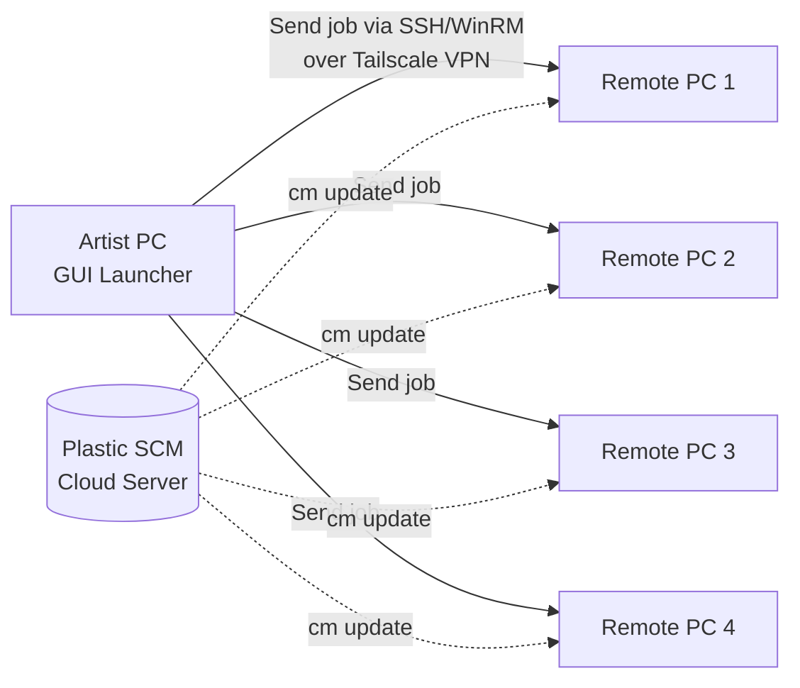

# Remote Render Plan for Unreal Engine MRQ

## Goal
Dispatch Unreal Engine Movie Render Queue (MRQ) render jobs from a single Artist PC to multiple Remote PCs — without needing to open the GUI on each machine — so renders can be kicked off from one location and executed across all available hardware.

---

## Your Network Topology

| Machine | Location | Network | Connectivity |
|:--------|:---------|:--------|:-------------|
| **Artist PC** (yours) | Location A | Own network | Internet only — no direct LAN to any Remote PC |
| **Remote PC 1, 2, 3** | Location B | Same LAN (shared between them) | Internet to Artist PC and Remote PC 4 |
| **Remote PC 4** | Location C | Separate network | Internet to all others |

**Key constraint:** No machine shares a LAN with the Artist PC. All cross-location communication must go over the internet.

**Shared infrastructure:** All PCs use **Plastic SCM** with the same cloud-hosted repository. The current render launcher already has a "Force Plastic Update" checkbox to sync to latest before rendering.

---

## Current Local Architecture (What Already Works)

The existing toolset runs entirely on one machine:

```
NK_RenderLauncher.ps1 (GUI)
  ├── User selects sequences, passes, overrides
  ├── For each selected sequence:
  │     └── Launches UnrealEditor-Cmd.exe with:
  │           -ExecutePythonScript="MRQ_Python_Executor.py"
  │           -Queue="<queue_asset_path>"
  │           -JobIndices="1,3"
  │           -Spatial=64 -Temporal=1 ...
  │
  └── MRQ_Python_Executor.py (runs inside UE)
        ├── Loads the queue asset
        ├── Filters jobs by index
        ├── Applies variable overrides (samples, resolution)
        ├── Calls render_queue_with_executor_instance()
        └── On cancel/failure: writes render_cancelled.marker
              → PS1 detects marker and stops pipeline
```

**What needs to change for remote:** Instead of launching `UnrealEditor-Cmd.exe` locally, the GUI must trigger that same launch command on a Remote PC.

---

## Proposed Remote Architecture

### Overview



### Step-by-Step Flow

1. **Artist opens GUI** on their own PC (same `NK_RenderLauncher.ps1`, extended with a "Target Machine" selector).
2. **Artist selects** sequences, passes, overrides — same as today.
3. **Artist selects target machine(s)** — a dropdown or checklist of Remote PCs (by name or Tailscale IP).
4. **GUI dispatches the job remotely:**
   - Connects to the Remote PC via **SSH** or **PowerShell Remoting** (`Invoke-Command`) through a **Tailscale VPN** tunnel.
   - Sends the exact same command that currently runs locally:
     ```powershell
     & "C:\Program Files\Epic Games\UE_5.7\Engine\Binaries\Win64\UnrealEditor-Cmd.exe" `
       "D:\Cloud Repositories-NK26\NK2026\NK2026.uproject" `
       -run=pythonscript -script="G:\2026\NK26\RemoteRender\MRQ_Python_Executor.py" `
       -Queue="/Game/.../NK_RenderQueue_0130_DialDrunk.NK_RenderQueue_0130_DialDrunk" `
       -JobIndices="1,2" -Spatial=64 -Temporal=1 `
       -unattended -nosound -nopause
     ```
   - But optionally runs `cm update` on the Remote PC first (Plastic SCM sync).
5. **Remote PC executes the render** using its own local GPU/CPU — same `MRQ_Python_Executor.py`, same Unreal project (synced via Plastic).
6. **Status reporting back to Artist PC:**
   - The SSH/WinRM session streams stdout/stderr back in real-time.
   - Or: the Remote PC writes a status file that the Artist GUI polls.
   - Cancel marker (`render_cancelled.marker`) still works — detected by the remote launcher script.

---

## Network Layer: Tailscale VPN

Since no machines share a LAN, we need a virtual network layer. **Tailscale** is the recommended choice:

- **Zero-config mesh VPN** — each machine installs Tailscale and joins the same Tailnet. Every machine gets a stable IP (e.g., `100.64.x.x`) and can reach every other machine directly, regardless of physical location or NAT.
- **No port forwarding needed** — Tailscale punches through NAT automatically.
- **Free tier** supports up to 100 devices — more than enough.
- **Works on Windows** — runs as a system service, survives reboots.

After Tailscale setup, from Artist PC you could do:
```powershell
# Test connectivity
ping 100.64.1.10   # Remote PC 1's Tailscale IP

# Run a remote command
ssh user@100.64.1.10 "echo hello from remote"
```

---

## Dispatch Method Options

### Option A: PowerShell Remoting (WinRM) — Recommended for Windows-to-Windows

Since all machines are Windows, PowerShell Remoting is the most natural fit:

```powershell
# On each Remote PC (one-time setup):
Enable-PSRemoting -Force

# From Artist PC, dispatch a render job:
Invoke-Command -ComputerName "100.64.1.10" -ScriptBlock {
    # Step 1: Plastic SCM update
    cd "D:\Cloud Repositories-NK26\NK2026"
    cm update .

    # Step 2: Launch Unreal render
    & "C:\Program Files\Epic Games\UE_5.7\Engine\Binaries\Win64\UnrealEditor-Cmd.exe" `
      "D:\Cloud Repositories-NK26\NK2026\NK2026.uproject" `
      -run=pythonscript `
      -script="G:\2026\NK26\RemoteRender\MRQ_Python_Executor.py" `
      -Queue="/Game/.../RenderQueue" `
      -JobIndices="1,2" -Spatial=64 `
      -unattended -nosound -nopause
}
```

**Pros:**
- Native Windows — no extra software beyond Tailscale
- Real-time stdout streaming back to Artist PC
- Can run async (`-AsJob`) and monitor multiple Remote PCs in parallel
- Integrates directly into existing PowerShell GUI

**Cons:**
- WinRM setup can be finicky with firewalls (but Tailscale sidesteps most of this)
- Requires the remote user account credentials or certificate auth

### Option B: SSH

Windows 10/11 includes an OpenSSH server. Enable it and dispatch via SSH:

```powershell
# From Artist PC:
ssh user@100.64.1.10 "powershell -File G:\2026\NK26\RemoteRender\RemoteWorker.ps1 -Queue '/Game/...' -JobIndices '1,2'"
```

**Pros:**
- Cross-platform if you ever use Linux render nodes
- Well-understood auth model (SSH keys)

**Cons:**
- Slightly more setup than WinRM on Windows
- Need to manage SSH key distribution

### Option C: Background Listener + Shared Queue File

Each Remote PC runs a lightweight polling script that watches a shared JSON file (synced via Dropbox/OneDrive or Plastic SCM):

```json
{
  "jobs": [
    {
      "id": "job-001",
      "status": "pending",
      "assigned_to": null,
      "queue": "/Game/.../RenderQueue",
      "job_indices": "1,2",
      "spatial": 64,
      "submitted_by": "ArtistPC",
      "submitted_at": "2026-06-05T10:00:00"
    }
  ]
}
```

**Pros:**
- No SSH/WinRM setup — works purely through file sync
- Remote PCs can self-serve ("claim" jobs when free)

**Cons:**
- Latency (file sync delay)
- Race conditions if two PCs claim the same job simultaneously
- More complex to implement than direct dispatch

---

## What Needs to Change in Current Scripts

### `NK_RenderLauncher.ps1` (GUI)

| Change | Details |
|:-------|:--------|
| **Add "Target Machine" UI** | Dropdown or checklist: "Local", "Remote PC 1", "Remote PC 2", etc. |
| **Remote PC config** | Store Tailscale IPs and credentials/SSH keys in a config file (e.g., `RemoteNodes.json`) |
| **Dispatch logic** | If target is not "Local", wrap the Unreal launch command in `Invoke-Command -ComputerName <IP>` |
| **Status polling** | For remote jobs, poll the SSH/WinRM session or read remote status files |
| **Parallel dispatch** | If user selects multiple Remote PCs with multiple sequences, assign sequences round-robin across machines |

### `MRQ_Python_Executor.py`

| Change | Details |
|:-------|:--------|
| **None required** | The Python script runs inside Unreal on whatever machine launches it — it doesn't care if it was triggered locally or remotely. The same script works as-is. |

### New Files

| File | Purpose |
|:-----|:--------|
| `RemoteNodes.json` | Config file listing Remote PCs: name, Tailscale IP, UE engine path, project path, credentials reference |
| `RemoteWorker.ps1` (optional) | A wrapper script deployed to each Remote PC that handles Plastic update + Unreal launch + status reporting. Simplifies the remote command to a single script call. |

---

## Handling Path Differences Across Machines

Each Remote PC may have the Unreal Engine and project installed at different paths. The `RemoteNodes.json` config handles this:

```json
{
  "nodes": [
    {
      "name": "Remote PC 1",
      "tailscale_ip": "100.64.1.10",
      "engine_path": "C:\\Program Files\\Epic Games\\UE_5.7\\Engine\\Binaries\\Win64\\UnrealEditor-Cmd.exe",
      "project_path": "D:\\Cloud Repositories-NK26\\NK2026\\NK2026.uproject",
      "script_dir": "G:\\2026\\NK26\\RemoteRender"
    },
    {
      "name": "Remote PC 4",
      "tailscale_ip": "100.64.2.5",
      "engine_path": "D:\\Epic Games\\UE_5.7\\Engine\\Binaries\\Win64\\UnrealEditor-Cmd.exe",
      "project_path": "E:\\Projects\\NK2026\\NK2026.uproject",
      "script_dir": "E:\\Projects\\NK26\\RemoteRender"
    }
  ]
}
```

The GUI reads this config and substitutes the correct paths when building the remote command. The **Queue asset paths** (e.g., `/Game/NOAH_KAHAN/...`) are Unreal internal paths — they are identical on all machines as long as Plastic SCM is synced.

---

## Render Output Handling

Renders output to local disk on the Remote PC (Unreal writes to the project's `Saved/MovieRenders/` folder or whatever the MRQ output setting specifies). Options for getting results back:

1. **Plastic SCM** — If the output folder is inside the workspace, results get pushed with the next `cm checkin`. But render outputs are typically large and shouldn't bloat the repo.
2. **Shared cloud folder** — Set MRQ output path to a Dropbox/OneDrive-synced folder on the Remote PC. Files auto-sync to Artist PC.
3. **Manual pull** — Artist uses `scp`, `robocopy`, or Windows file sharing over Tailscale to pull renders from the Remote PC when done.

---

## Cancel Propagation (Remote)

The existing cancel mechanism (`render_cancelled.marker` file) works locally. For remote jobs:

- **With SSH/WinRM session open:** The Artist GUI can send a kill signal to terminate the remote Unreal process (`Stop-Process -Name UnrealEditor-Cmd`).
- **With marker file:** The `MRQ_Python_Executor.py` still writes `render_cancelled.marker` on the Remote PC. The remote wrapper script (`RemoteWorker.ps1`) detects it and reports back.
- **GUI reflects status:** The launcher polls the remote session and updates the status label (e.g., "Remote PC 1: Rendering sequence 2/4 (8 total jobs)" or "Remote PC 1: Cancelled").

---

## Minimum Viable Implementation (Phase 1)

The simplest version that gets remote rendering working:

1. **Install Tailscale** on Artist PC + all Remote PCs → join same Tailnet.
2. **Enable WinRM** (or SSH) on each Remote PC.
3. **Create `RemoteNodes.json`** with each PC's Tailscale IP and paths.
4. **Add a "Target Machine" dropdown** to the GUI — defaults to "Local".
5. **Wrap the existing launch command** in `Invoke-Command` when a remote target is selected.
6. **Test** with one Remote PC, one sequence, one pass.

No new infrastructure, no database, no web server. Just Tailscale + the existing scripts + remote dispatch.

---

## Reference Note

> The concept of a central dispatch machine sending render jobs to headless worker nodes is similar to how DaVinci Resolve Studio's Remote Rendering works — where an artist dispatches export jobs to render nodes that poll a shared PostgreSQL database. The key difference: Resolve requires all machines to mount the same shared storage (NAS), making it effectively LAN-only. Our Unreal setup avoids this constraint entirely because **Plastic SCM handles asset synchronization** and renders output locally on each node.
